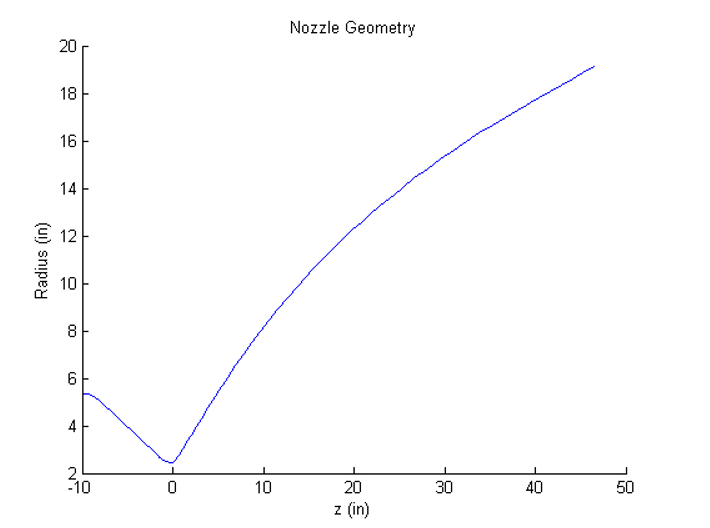
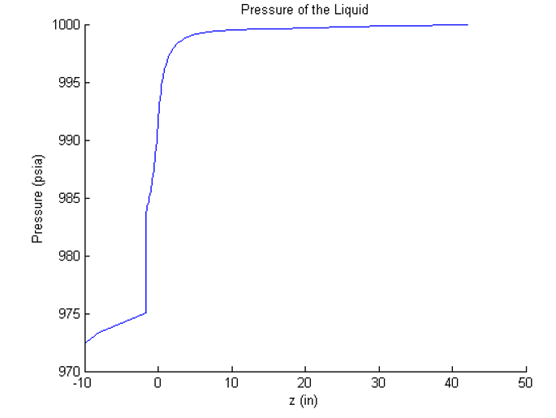
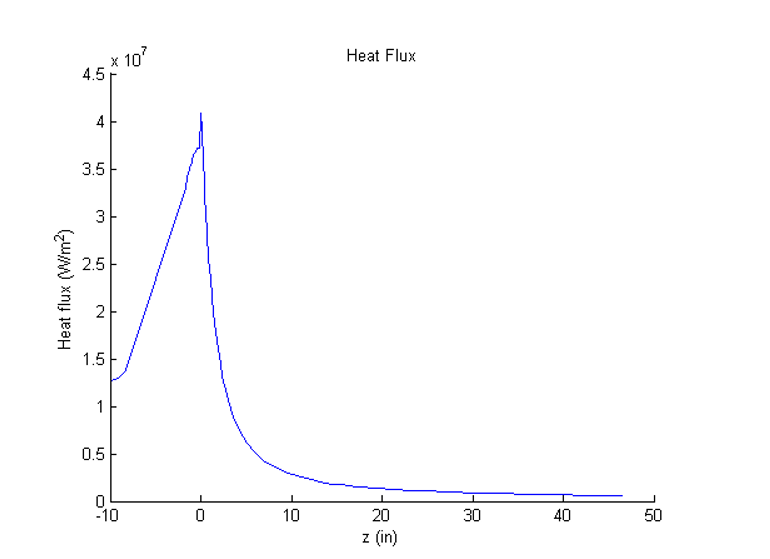
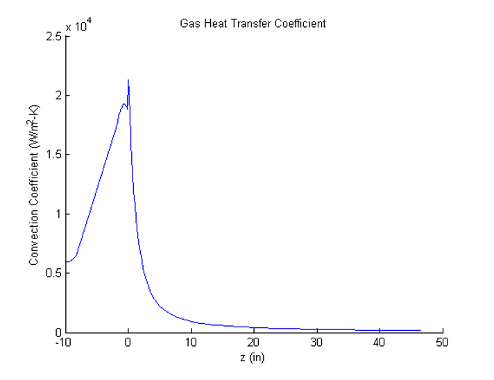
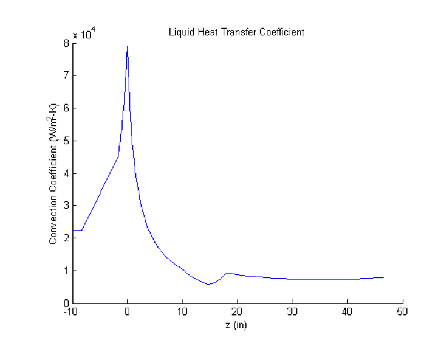
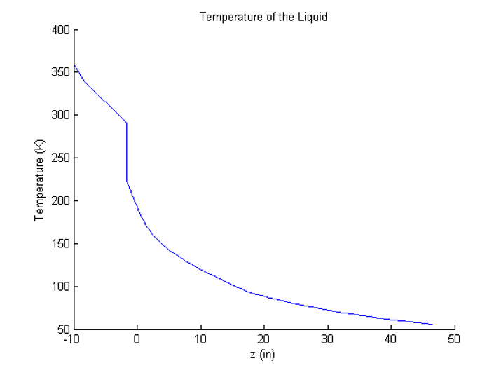
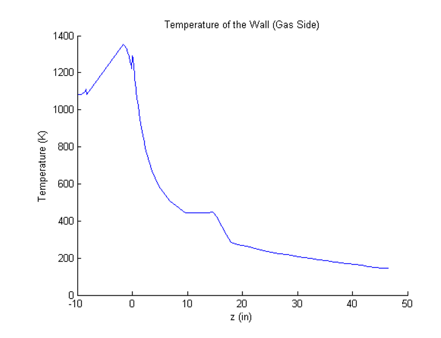

# RegenerativeCoolingModel
Modelling pressure and temperature of regenerative cooling tubes in a rocket nozzle

 An analysis of the regenerative cooling jacket used on the RL10-3-3A engine manufactured by Pratt and Whitney for use in the Centaur upper stage.  This engine utilizes cryogenic LOX/LH2 propellants in an expander cycle to produce 16,500 lbf of vacuum thrust.  The regen jacket is a 1 ½ pass design in that the coolant (LH2) enters the jacket about halfway down the exit cone, travels to the end of the cone, turns around and flows forward to a collector manifold near the injector.  There are 180 tubes in the “downcomers” flowing aft in the exit cone, and there are 180 tubes in the “upcomers” flowing the length of the nozzle/chamber.  The tube crosssectional area and perimeter are plotted as a function of distance are given.  The analysis starts in the turn-around manifold, where the pressure and temperature of the coolant are assumed to be 1000 psi, and 100 R, respectively.

Given:  RL10-3-3A, LOX/LH2 propellants,  nozzle wall coordinates, local tube cross-sectional area and perimeter, Chamber pressure and mixture ratio (475 psi and 5), Manifold pressure and temperature of coolant (1000 psi, and 100R)

Assumptions: 1-D compressible flow, friction, temperature-dependent properties, convection/conduction heat transfer

Using ???? for gas convection transfer coefficient and ??? for liquid heat transfer coefficient.

Run through Main.m

